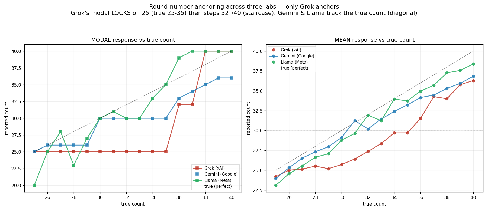

# Round-number anchoring in vision-LLM number estimation

A follow-up to the [number-sense](../README.md) study. Tests whether vision-LLMs, when
estimating "how many objects?", **anchor their answers on round numbers** (multiples of 5/10)
the way humans do — and finds that it depends heavily on the model.

## Why this study exists

The main number-sense study used set sizes 15, 20, 25, 30, 40 at the high end. Those are
*themselves* almost all round numbers, so they cannot test for round-number anchoring: the
models were essentially never shown a non-round quantity in the range where rounding would
surface. A claim either way ("models anchor" / "models don't") would have been unsupported by
that design.

So we ran a dedicated test: **every integer from 25 to 40** (round anchors 25/30/35/40
interleaved with non-round fillers 26–29, 31–34, 36–39), 15 distinct layouts × 15 calls = 225
fresh calls per true count, per model. Dot size is jittered so total area is decorrelated from
count (area plateaus across 25–40), so any clustering reflects *number*, not ink. Same neutral
wording ("How many objects are in this image?"), collect-only, scored by reading the responses.

## How to read the result

The decisive view is **modal response vs. true count** (the single most common answer at each
true N):

- **Anchoring** looks like a *staircase*: the modal answer stays flat across a run of true
  counts (e.g. locked on 25 for true 25, 26, 27, …) and only jumps when forced to the next round
  value. The model's most likely answer ignores the true count.
- **Honest estimation** looks like a *diagonal*: the modal answer climbs with the true count.

(We avoid leaning on "% of answers that are a multiple of 5" as the headline: at true N = 25,
answering "25" is also just *correct*, so that metric conflates anchoring with accuracy. The
modal staircase and the per-N histograms are the clean signals.)

## Result: anchoring is model-specific — only Grok anchors



| Model | Anchors? | Modal behavior (true 25 → 40) |
|---|---|---|
| **Grok** (grok-4.20-non-reasoning, xAI) | **Yes, strongly** | modal **locked on 25 from true 25 through 35**, then steps to 32, then 40 — a staircase |
| **Gemini** (gemini-2.5-flash-lite, Google) | No | modal **climbs with the true count** (tracks the diagonal) |
| **Llama** (llama-3.2-11b-vision, Meta) | No | modal **climbs with the true count** (noisy; mild stickiness on 40 at the top) |

- **All three systematically *under-estimate*** (mean below the true count, gap widening with N) —
  a shared compression. But only Grok's *modal* answer anchors.
- **Grok's anchoring is dramatic**: its single most likely answer doesn't move across an 11-unit
  range of true counts (25→35). See [`figures/anchor_grok_hist_curve.png`](figures/anchor_grok_hist_curve.png)
  and the per-N histograms [`figures/anchor_grok_hist.png`](figures/anchor_grok_hist.png).
- **Gemini and Llama track** the true count with no round-number lock-on
  ([gemini](figures/anchor_gemini_hist_curve.png), [llama](figures/anchor_llama_hist_curve.png)).

**Takeaway:** round-number anchoring — a documented human estimation strategy (anchoring-and-
adjustment; people cluster numerosity estimates on round values, e.g. Tversky & Kahneman 1974;
Solstad et al. 2026) — appears strongly in one frontier model and is absent in two others. It is
**not a universal property of vision-LLM number estimation.** It belongs to each model's
particular "numerical personality."

## Honest caveats

- **Llama is the noisiest model** (smallest of the three). ~5–8% of its responses per cell were
  refusals, garbled output, or wild outliers (e.g. 113, 1372, 35000); those were dropped during
  reading. Its "tracking" is real but messy. Its noise partly reflects capacity, not just a
  different number sense.
- **Scoring is by reading.** The `ai_read_answers.json` per model contains the values a reader
  extracted from the raw responses (with X for refusals/garble). The `raw.jsonl` holds every
  verbatim response — re-score it if you want to check us. See [`../../PROTOCOL.md`](../../PROTOCOL.md).
- **Three small/cheap models, one prompt, one session.** Whether anchoring emerges at frontier
  scale, or under different prompts, is open.

## Files

```
anchoring/
├── stimuli/manifest.csv          # the dense 25-40 stimulus set (ground truth; PNGs regen from gen_stimuli.py seed 113)
├── data/<model>/raw.jsonl        # every verbatim response (225 per true count)
├── data/<model>/ai_read_answers.json   # answers scored by reading
├── figures/anchor_<model>_hist.png      # per-true-N response histograms
├── figures/anchor_<model>_hist_curve.png # mean & modal vs true count
├── figures/anchor_three_model.png        # the decisive 3-model comparison
├── plot_anchor.py                # render per-model figures from ai_read_answers.json
└── plot_three.py                 # render the 3-model comparison
```

Regenerate the stimuli: `python3 ../gen_stimuli.py --sizes 25,26,27,28,29,30,31,32,33,34,35,36,37,38,39,40 --reps 15 --types A --seed 113 --out stimuli`
